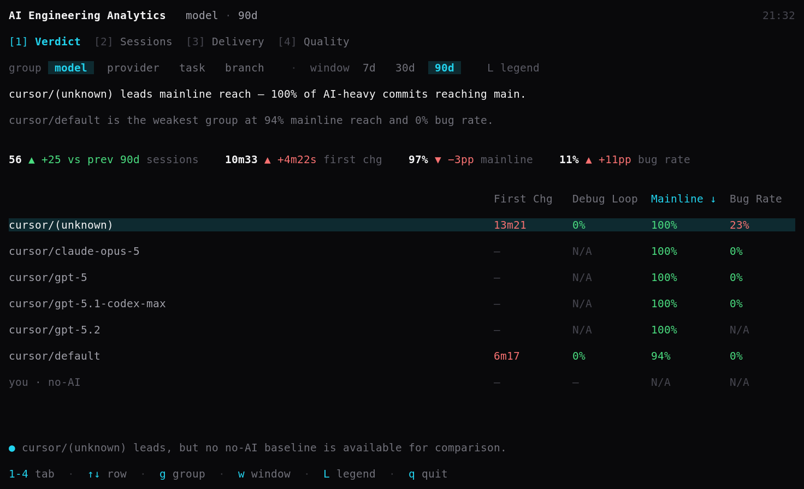
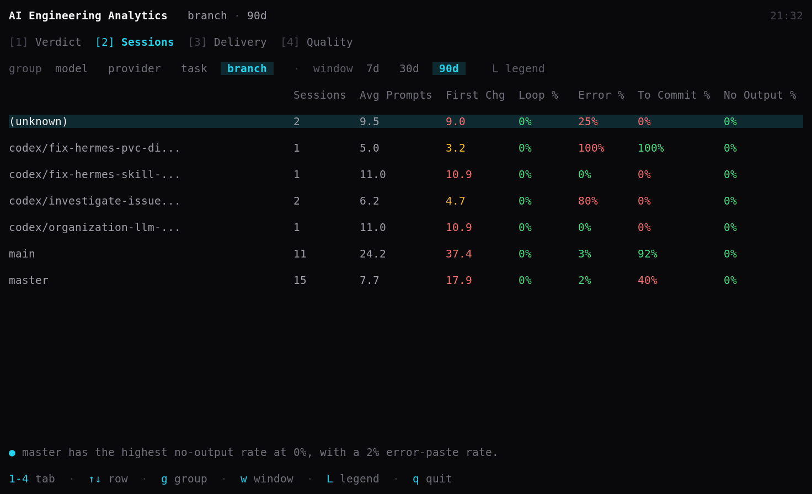
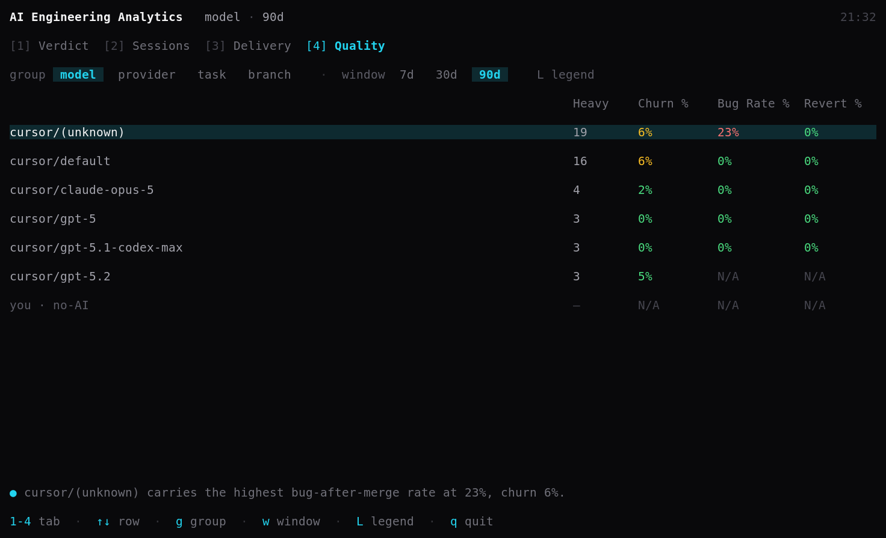
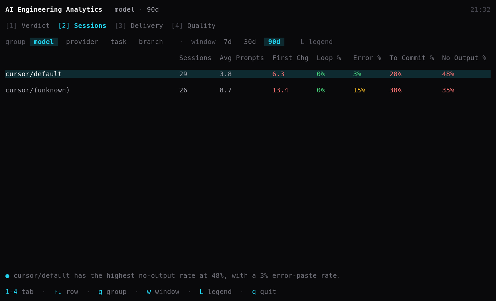
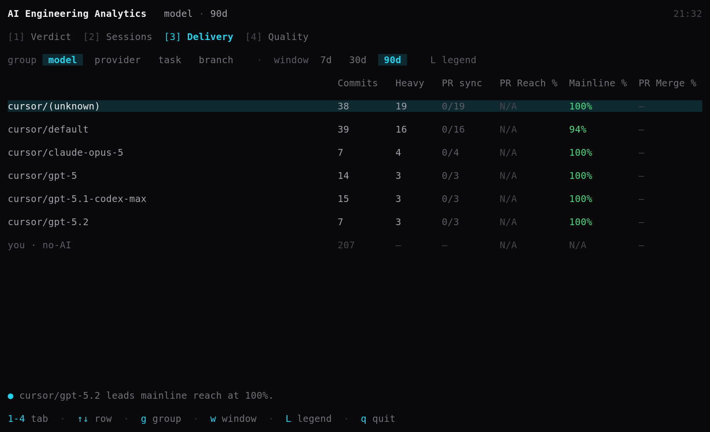
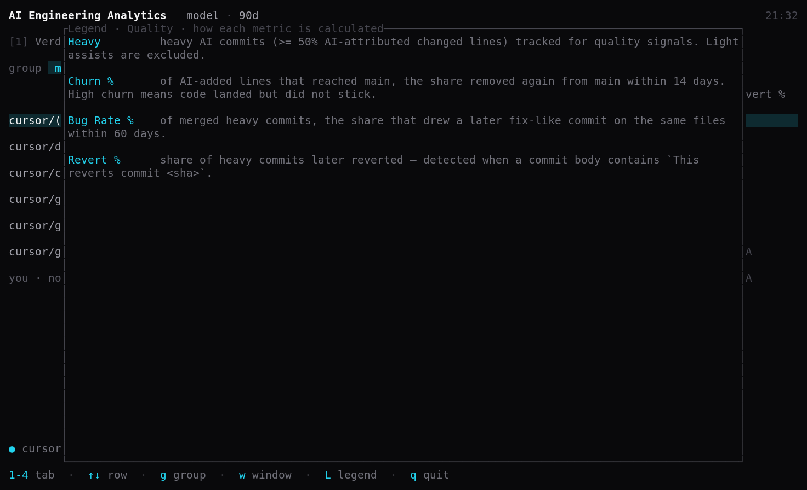

# PaceFlow — AI Engineering Analytics

[](https://github.com/PaceFlow/ai-engineering-analytics/actions/workflows/ci.yml)
[](https://github.com/PaceFlow/ai-engineering-analytics/releases)
[](LICENSE)

**See which coding-agent sessions turn into shipped, lasting code—and what they cost.**

PaceFlow is a local-first CLI with an interactive terminal dashboard for engineers using **Claude Code, Codex, Cursor, and OpenCode**. It connects local assistant history with git commits to help you understand where agents save effort, where work gets stuck, and what happens to the code after it lands.

The command is **`vca`**. The install package is `paceflow`; the `paceflow` command is also available as a compatibility alias.

[Get started](#get-started) · [Explore reports](#explore-reports) · [User guide](docs/USER_GUIDE.md) · [Troubleshooting](docs/TROUBLESHOOTING.md)



*The interactive dashboard: a 90-day view of real Cursor history, with model comparisons and changes from the preceding period. All screenshots show the full running app, captured from a local data snapshot on September 11, 2026.*

## What can you learn?

| Your question | Report | What it measures |
| --- | --- | --- |
| How much steering does agent work need? | `vca session` | Prompts, time to first accepted change, retry loops, and sessions followed by commits |
| Does the work reach review and mainline? | `vca delivery` | AI-heavy commits, PR reach, merge rate, and mainline lead time |
| Does the code hold up after landing? | `vca quality` | Code churn, follow-up fixes, and reverts |
| What does useful output cost? | `vca cost` | Token usage, API-equivalent cost, and cost per accepted or mainline output |

Use these signals to investigate your workflow: compare providers, inspect a branch or task, and see whether smaller tasks or earlier validation improve the results.

## Get started

You need **git** on your `PATH` and local history from at least one supported coding assistant. Local reports require no PaceFlow account. GitHub PR metrics are optional.

### 1. Install

With the Rust toolchain installed, compile from crates.io:

```bash
cargo install --locked paceflow
```

If you already have **cargo-binstall**, install a prebuilt binary:

```bash
cargo binstall paceflow
```

You can also download a binary from [GitHub Releases](https://github.com/PaceFlow/ai-engineering-analytics/releases). Release targets are Linux x86_64 (glibc), macOS Apple Silicon, and Windows x86_64. See the [install notes](packaging/INSTALL.md) for platform commands, Gatekeeper, and PATH setup.

### 2. Ingest your history

Run from the git repository you want to analyze:

```bash
cd /path/to/your/repo
vca ingest
```

Ingestion reads local assistant history, associates code changes with git commits, and builds a SQLite analytics database at `~/.paceflow/paceflow.db`. Re-run `vca ingest` when you have new sessions or commits.

### 3. Explore the dashboard

```bash
vca tui
```

The interactive dashboard combines **Verdict, Sessions, Delivery, and Quality** views. Switch tabs with `1`–`4`, cycle model/provider/task/branch grouping with `g`, and switch between 7-, 30-, and 90-day windows with `w`. Use `↑`/`↓` to select rows, `L` to open metric definitions, and `q` to quit.

Use `vca tui --all-projects` to explore all tracked repositories. The Verdict view summarizes outcomes and changes from the preceding time window; the other tabs show the underlying comparisons.

### 4. Run individual reports

For printable output and additional filters, use the report commands. Cost is available as a separate CLI report:

```bash
vca session                 # Compare sessions by model
vca delivery                # See what reached review and mainline
vca quality                 # Inspect churn, fixes, and reverts
vca cost                    # Compare estimated cost and useful output
```

The dashboard and report commands default to the current repository and group by model. For a single printable summary, run `vca session --overall`.

**No rows?** Try `vca session --all-projects` to check whether sessions were associated with another repository. See [troubleshooting](docs/TROUBLESHOOTING.md) for missing provider data and rebuild instructions.

## Explore reports

Compare by provider, branch, task, repository, or model. All four reports share the same filters.

```bash
vca session --group-by provider
vca delivery --group-by branch
vca quality --task ABC-123
vca cost --provider codex --all-projects
vca session --from 2026-03-01 --to 2026-03-31
vca delivery --repo /path/to/another/repo
```

Use `--model <provider/name>` to focus on a model shown in your report, `--overall` for a summary, or `--limit 10` to shorten grouped output. `vca session --list-sessions` drills down to individual sessions. Run `vca <command> --help` for all options.

### Compare workflows and outcomes

The Sessions view makes differences in steering effort visible. Here, grouping by branch compares prompts, time to first change, and how often sessions are followed by a commit.



The Quality view follows AI-heavy commits after landing. Compare churn and follow-up fixes alongside the number of commits behind each rate.



<details>
<summary>More views: sessions by model, delivery, and metric definitions</summary>

**Sessions by model** shows where sessions need more prompts, take longer to produce an accepted change, or produce no accepted output.



**Delivery** connects AI-heavy commits to mainline outcomes. This local snapshot has no completed GitHub PR lookups, so PR metrics remain unavailable.



**Metric definitions** are available inside the dashboard. Press `L` to open the legend for the current tab.



</details>

*These examples reflect one engineer's Cursor history, not a cross-provider benchmark. Model labels, including default and unknown values, appear as recorded by the provider.*

### Add GitHub PR context

To include GitHub PR reach and merge metrics, save a token and refresh:

```bash
vca github token
vca ingest
vca delivery
```

`PACEFLOW_GITHUB_TOKEN` provides an environment override for CI or one-off runs. Without GitHub credentials, you can still use local session and git analytics.

## How it works—and how to interpret it

1. **Read history:** parse locally stored assistant sessions and code changes.
2. **Connect changes:** match AI-attributed lines to git commits and track mainline outcomes.
3. **Report outcomes:** aggregate session, delivery, quality, and cost signals across your chosen scope.

Attribution depends on the history each provider records and the changes that can be matched. An **AI-heavy commit** has matched AI-attributed lines making up at least half of its changed lines. Missing or ambiguous history can reduce coverage.

Quality metrics are signals to investigate: churn and later fix-like commits do not establish that AI caused a defect. Status bands are opinionated thresholds. Cost uses provider-reported cost when available and otherwise an **API-equivalent estimate**; it does not represent your subscription bill. Unknown models can remain unpriced. Compare coverage and task context alongside the numbers.

See the [user guide](docs/USER_GUIDE.md) for metric definitions, denominators, status bands, and interpretation.

## Local data and optional team sync

Local ingestion and reports store analytics on your machine under `~/.paceflow`. `PACEFLOW_HOME` changes the base directory; the database then lives at `$PACEFLOW_HOME/.paceflow/paceflow.db`. GitHub integration fetches remote PR metadata when a token is configured.

Team sync is a separate, optional workflow. `vca sync config` sets up authentication and an organization; `vca sync push` uploads normalized analytics events to the PaceFlow backend. `vca sync schedule install` enables recurring ingestion and uploads every six hours. Check `vca sync --help` before configuring shared analytics.

## Documentation and contributing

- [User guide](docs/USER_GUIDE.md): metrics, grouping, and interpretation
- [Install notes](packaging/INSTALL.md): binaries, platform setup, and configuration
- [Troubleshooting](docs/TROUBLESHOOTING.md): missing data, provider overrides, and rebuilding
- [Development notes](DEV.md): local workflows, profiling, and validation
- [Architecture](docs/ARCHITECTURE.md): ingestion, storage, and the analytics pipeline

Bug reports and contributions are welcome through [issues](https://github.com/PaceFlow/ai-engineering-analytics/issues) and pull requests. Include the command, platform, provider, and expected behavior; use anonymized examples when sharing session data.

To build from a checkout:

```bash
git clone https://github.com/PaceFlow/ai-engineering-analytics.git
cd ai-engineering-analytics
cargo build
cargo test
cargo clippy --all-targets --all-features
```

Licensed under the [MIT License](LICENSE).
